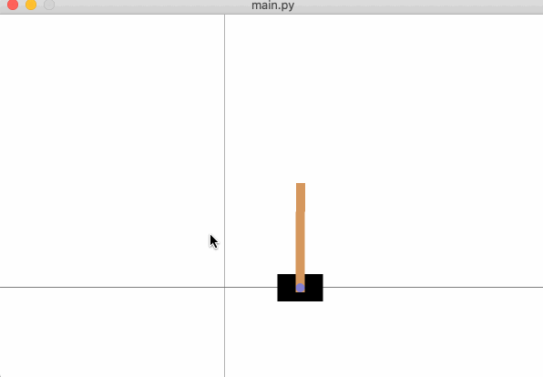
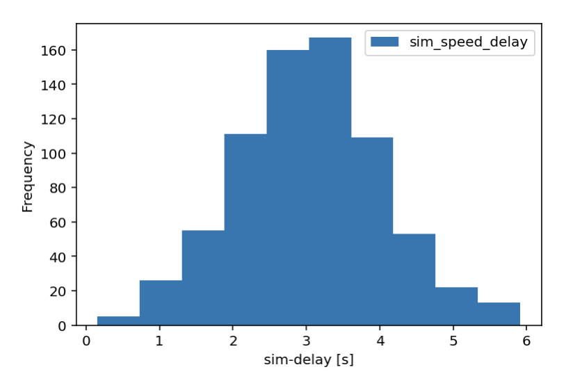

# Cartpole with Project Bonsai

## Objective

Starting with the pendulum upright, prevent the system from falling down by moving the cart left or right. 


# States, Actions, and available Configuration

See [machine_teacher.ink](machine_teacher.ink).

## Simulator API - Python

- `cartpole`
    - `reset()`
    - `step()`
- `viewer`
    - `update()`

## Testing Simulator Locally

You can test the simulator integration by running:

```bash
pytest tests/
```

You can run the simulator with random actions (without connecting to a brain):

```bash
python main.py --test-random --render
```

## Connecting a local instance of the simulator to a brain

Run the simulator locally by:

```bash
python main.py
```

and then attach to your brain:

```
bonsai simulator unmanaged connect \                          
    -b <brain_name> \
    -a Train \
    -c BalancePole \
    --simulator-name Cartpole 
```

Use `python main.py -h` to see more options.

## Running the simulator with an exported brain

Export a trained brain and run it locally using docker. Then, run the following:

```bash
python main.py --test-exported
```

or

```bash
python main.py --test-exported 5001
```

if your exported brain isn't running on the default port of 5000.

## Building Simulator Packages

Using the `azure-cli`, you can build the provided dockerfile to create a simulator package (note the trailing period!):

```azurecli
az acr build --image <IMAGE_NAME>:<IMAGE_VERSION> --file Dockerfile --registry <ACR_REGISTRY> .
```

`<IMAGE_NAME>:<IMAGE_VERSION>` could be e.g. `carts_and_poles:v1`. You can look up `<ACR_REGISTRY>` in the workspace info in the Bonsai UI.

If you get an error like this:

```
The resource with name <ACR_REGISTRY_NAME> and type 'Microsoft.ContainerRegistry/registries' could not be found in subscription '<something>'
```

look up your subscription id in the workspace info in the Bonsai UI, and run 

```azurecli
az account set --subscription <SUBSCRIPTION_ID>
```

Once you've built the simulator package, you can use the Bonsai Web UI to import the simulator (look for the `+ Add sim` button) or use the [`bonsai-cli`](https://pypi.org/project/bonsai-cli/)'s [bonsai simulator package add](https://docs.microsoft.com/en-us/bonsai/cli/simulator/package/add) command.

# Additional examples

## Go-to-point with multiple concepts



[multi-concept.ink](multi-concept.ink) shows an example with multiple concepts, to solve the go-to-point problem: moving the cart to a particular location without dropping the pole. 

After training with this Inkling, you can test with an exported brain. Export and run the container as usual, then run the following (adding a port number after `--test-exported` if not using the default of 5000):

```bash
python main.py --test-exported --render --iteration-limit 10000
```

Click on different locations in the visualization and watch the cart move to that point.

## Emulating a slow simulator

For testing purposes, one may want to emulate a slow simulator. The arguments:
- `--sim-speed` adds a delay in seconds before stepping through an iteration (emulating sim speed)
- `--sim-speed-variance` adds stochasticity to the sim speed (optional). The sim delay is  normal-distributed, centered around `mean = sim-speed` with a variance for `sigma = sim-speed-variance` and truncated between `[sim-speed - 3*sim-speed-variance, sim-speed + 3*sim-speed-variance]`. Note: if `sim-speed - 3*sim-speed-variance < 0`, lower bound = 0

The example below emulates a sim speed centered around 3s, with a variance of 1s, within bounds of [0,6]s

```shell
python main.py --sim-speed 3 --sim-speed-variance 1
```


Note: to build the sim container for sim scaling, replace the command to run the simulator with user defined arguments (see commented out line in Dockerfile)