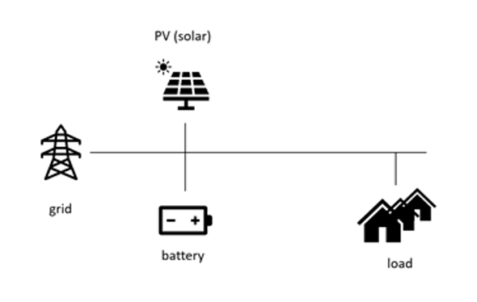
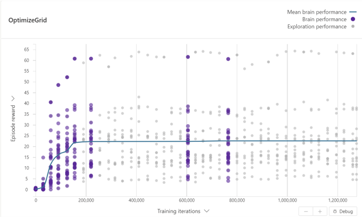
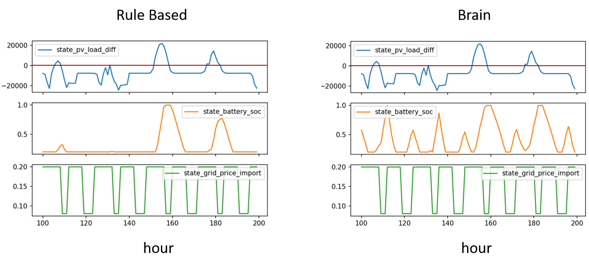

# Microgrid

## Use case problem

### Problem description

A microgrid is a local energy grid with various power sources and loads that typically operates connected to a traditional grid but is also capable of disconnecting from the traditional grid and operate autonomously. Microgrids can improve the resiliency of power supply by providing backup for the grid in case of emergencies. They can also integrate renewable energy resources and reduce CO2 emissions.

In this sample, we work on a microgrid that is connected to a traditional grid. The microgrid has a Solar Photovoltaic (PV) system, a battery to store energy and a variable load.



We can control the microgrid to meet the load by taking actions such as charging or discharging the battery, importing energy from or exporting energy to the traditional grid and consuming any generated PV power. 

### Objective
Meet the load while minimizing the energy cost and CO2 emissions while maximizing the usage of renewable energy.

There are associated costs with each microgrid components, such as cost for importing energy from the grid, cost of operating the battery or CO2 emissions by the traditional grid. The brain's goal is to find the optimal actions such that the costs and CO2 emissions are minimized, while meeting the load.

## Problem simulation description

For this sample we will use the [pymgrid](https://github.com/Total-RD/pymgrid) simulator written in Python. The pymgrid model can simulate a variety of microgrid architectures, though we will focus on one that is connected to a grid and that has a PV, battery and variable load.

The model simulates a microgrid with real PV, load and CO2 emissions data recorded at every hour for a year. With a control frequency of 1 hour, we can specify amount of power we consume from the PV, amount of power we charge/discharge the battery and amount of power we import from/export to the grid and the model simulates the load, accumulated PV power, battery state of charge (SOC), battery capacity to charge/discharge, status of the grid (on/off), CO2 emission of the grid and grid tarrif at the next hour.


### Problem description

|                        | Definition                                                   | Notes |
| ---------------------- | ------------------------------------------------------------ | ----- |
| Objective              | Meet the load while minimizing the energy cost and CO2 emissions while maximizing the usage of renewable energy                                                                        | |
| Observations           | load, accumulated PV, battery capacity to charge, battery capacity to discharge, grid status, grid CO2 emission, grid price, hour of the day  											  | |
| Actions                | battery power                         						| |
| Control Frequency      | Every hour 													| |
| Episode configurations | The time index that specifies day/time of the year to start the episode with                                                                                    | |
| Episode                | 2 days														| |

## Solution approach

While we can set-up the brain to recommend actions to take on how much grid power to import/export, how much PV to consume and how much to charge/discharge the battery, only the decision the Brain will make on the battery will have a long term effect. The decisions on the PV and the grid have instantenous effects. Because of this, we let the Brain to take actions only on the battery (how much to charge or discharge). In post processing we then decide on how much PV to consume and how much power to import/export to the grid with the following logic: We first calculate the total demand by summing the load and the battery power (as suggested by the Brain), if there is excess power at hand, we export it to the grid. If there is a deficiency, we first consume from the PV as much as we can, and import the remaining from the grid.

With this workflow, we already know how much we are importing from or exporting to the grid. Then the total cost of running the microgrid is calculated by how much power we are importing from the grid, with a small cost added for CO2 usage. We then normalize this cost before we use it in the reward function.

### Results

We have trained a Brain with the above formulation for over a million iterations. Below figure shows the training graph with the normalized rewards.



We benchmarked our results with a rule-based policy. The rule based policy is designed such that it would charge the battery whenever there is excess PV (after using the maximum amount we can to meet the load first), and it would discharge the battery whenever there is deficiency, without considering the grid pricing. 

To compare the brain with the rule-based policy we calculated the cost of running the grid for 1000 hours. The average cost with the grid is $1300.04/hour, whereas the average cost with the rule-based policy is $1488.9/hour. This means that the brain is performing ~12% better. The reason for the extra cost savings with the brain is illustrated below. In addition to learning to charge the battery when there is excess PV, the brain also learned to charge when the grid price is cheap, and to discharge when the grid price is expensive.




## Install Requirements

1. Download **either** [miniconda](https://conda.io/miniconda.html) or [Anaconda](https://www.anaconda.com/download/)
2. Open Anaconda / miniconda command prompt
3. Change directory to where this repository is located and run
    ```cmd
    conda env create -f environment.yml
    ```
4. Activate the Conda environment we just created by running:
    ```cmd
    conda activate bonsai-mgrid
    ```

## Running the Simulator Locally

Run the simulator locally by the following command and setting environment variables for SIM_WORKSPACE and SIM_ACCESS_KEY.

```bash
python main.py
```

and then attach to your brain using the web UI.

## Building Simulator Packages

Using the `azure-cli`, you can build the provided dockerfile to create a simulator package to run the simulator at scale on the Bonsai platform:

```bash
az acr build --image <IMAGE_NAME>:<IMAGE_VERSION> --file Dockerfile --registry <ACR_REGISTRY> .
```


## Evaluation

We evaluated our results by exporting the trained brain and used it with the sim using main.py. Logs will be saved to `/logs` as csv format.

```sh
export SIM_WORKSPACE=<your-workspace-id>
export SIM_ACCESS_KEY=<your-access-key>
az login
az acr login -n <acr-name>
docker pull <brain-uri>
docker run -d <brain-uri>
python main.py --test-exported --log-iterations --iteration-limit 1000
```

We can also run the rule-based policy with the sim to compare.

```sh
python main.py --test-rule-based --log-iterations
```

## Useful Resources

- [Bonsai Docs](https://docs.microsoft.com/en-us/bonsai/)
