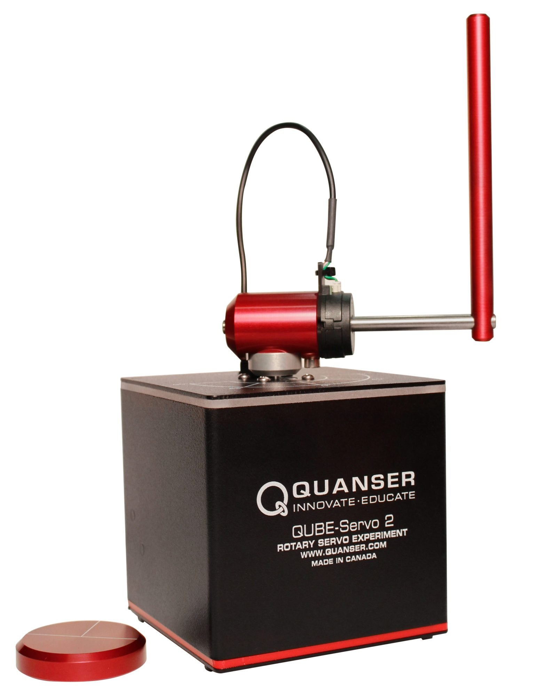

# Quanser Qube - Servo2 with Project Bonsai 

For more information about the Qube click [here](https://www.quanser.com/products/qube-servo-2/)



## Objective

Train brain for two different concepts, either swing up or balance

### SwingUp - starting near rest (machine_teach_swingup.ink)

- Reset starts the pendulum from the bottom (at rest).
- The task is to flip up the pendulum angle (alpha) from rest.
- Episode ends once the motor angle (theta) is greater than 90 degrees.

### Balance - starting near vertical (machine_teach_balance.ink)

- Reset starts the pendulum from the top (flipped up/inverted).
- The task is to hold the pendulum angle (alpha) upright and center in between motor limits.
- Episode ends once the pendulum angle (alpha) is greater than 12 degrees or motor angle (theta) is greater than 90 degrees.

## Action

| Action | Continuous Value | Units   |
| ------ | ---------------- | ------- |
| Vm     | [-3, 3]          | [Volts] |

## States

| State     | Units     | Description                                             |
| --------- | --------- | ------------------------------------------------------- |
| theta     | [rad]     | angle of arm from centered at the front                 |
| alpha     | [rad]     | angle of pendulum from upright                          |
| theta_dot | [rad / s] | angular velocity of arm from centered at the front      |
| alpha_dot | [rad / s] | angular velocity of pendulum from centered at the front |

## Terminal Conditions

- Pendulum exceeds ±12° from vertical
- Motor limits of ±90°
- Episode length greater than 8 s

## Configuration Parameters

- Rm - Motor Resistance [Ohm]
- kt - Motor Current-torque [N-m/A]
- km - Motor Back-emf constant [V-s/rad]
- mr - Rotary Arm Mass [kg]
- Lr - Rotary Arm length [m]
- Dr - Rotary Arm equivalent viscous damping coefficient [N-m-s/rad]
- Lp - Pendulum Link Length [m]
- mp - Pendulum Link Mass [kg]
- Dp - Pendulum Link equivalent viscous damping coefficient [N-m-s/rad]
- frequency - Rate of of decision making and simulation dt [Hz]
- theta - initial theta [rad]
- alpha - initial alpha [rad]
- theta_dot - initial theta_dot [rad / s]
- alpha_dot - initial alpha_dot [rad / s]

## Simulator API - Python

- reset()
- step()
- view()

## Install Requirements

1. Download **either** [miniconda](https://conda.io/miniconda.html) or [Anaconda](https://www.anaconda.com/download/)
2. Open Anaconda / miniconda command prompt
3. Change directory to the parent directory
    ```cmd
    conda env update -f environment.yml
    conda activate bonsai-preview
    cd Python/samples/quanser-qube
    pip install -r requirements.txt
    ```

## Running the Simulator Locally

Run the simulator locally without connecting to the platform to test the API.

```bash
python main.py --test-local --render
```

Once you are satisfied, you can run the simulator again and connect to the Bonsai platform (note you can still use the `render` argument to visualize the simulator while training):

```bash
python main.py --config-setup
```

and then attach to your brain:

```bash
bonsai simulator unmanaged connect \                          
    -b <brain_name> \
    -a Train \
    -c <concept_name> \
    --simulator-name QuanserQube
```

## Building Simulator Packages

Using the `azure-cli`, you can build the provided dockerfile to create a simulator package:

```
az acr build --image <IMAGE_NAME>:<IMAGE_VERSION> --file Dockerfile --registry <ACR_REGISTRY> .
```

## Useful Resources

- [Bonsai Docs](https://docs.microsoft.com/en-us/bonsai/)

## Acknowledgements

The sample has been inspired and adapted from [BlueRiverTech/quanser-openai-driver](https://github.com/BlueRiverTech/quanser-openai-driver) by Kirill Polzounov.