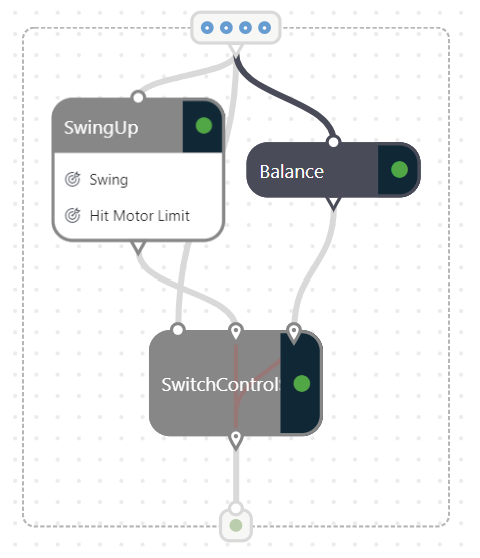
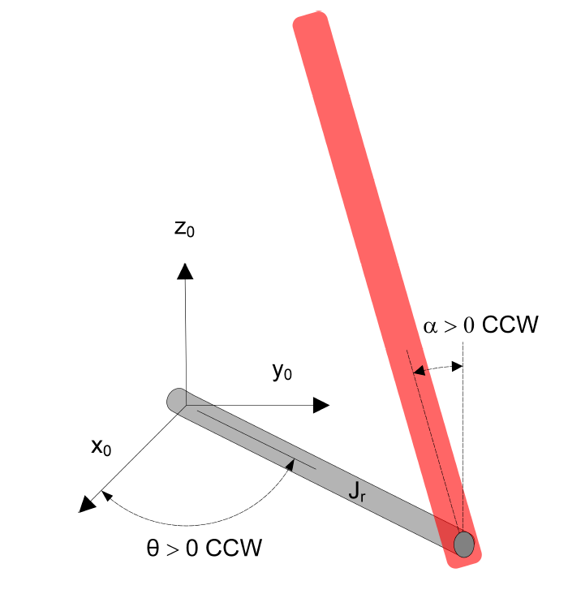

# Quanser Qube - Servo2 with Project Bonsai

For more information about the Qube click see the [product page](https://www.quanser.com/products/qube-servo-2/). To learn more about this simulator, see this [whitepaper](https://arxiv.org/pdf/2001.02254.pdf).


## Objective

Train a multi-concept brain with a learned selector choosing between two strategies: 1) Linear Quadratic Controller (LQR) that's programmed and 2) a learned concept for swinging up. Typically control theory will have separate controllers for the problem of swing up and balance. The reason is because the controllers are designed about different equilibrium points, i.e. pendulum at rest or pendulum upright. The learned selector gets trained after the two concepts are created and uses the state variables as input to strategically select which strategy to use.


### SwingUp - starting near rest

- Reset starts the pendulum from the bottom (at rest).
- The task is to flip up the pendulum angle (alpha) from rest.
- Episode ends once the motor angle (theta) is greater than 90 degrees.

### Balance - starting near vertical

- Reset starts the pendulum from the top (flipped up/inverted).
- The task is to hold the pendulum angle (alpha) upright and center in between motor limits.
- Episode ends once the pendulum angle (alpha) is greater than 12 degrees or motor angle (theta) is greater than 90 degrees.



## Reference Frames and Coordinates

When `alpha` is zero, the pendulum is upright. `theta` is the angle in the horizontal plane.



## Action

| Action | Continuous Value | Units   |
| ------ | ---------------- | ------- |
| Vm     | [-3, 3]          | [Volts] |

## States

| State     | Units     | Description                                             |
| --------- | --------- | ------------------------------------------------------- |
| theta     | [rad]     | angle of arm from centered at the front                 |
| alpha     | [rad]     | angle of pendulum from upright                          |
| theta_dot | [rad / s] | angular velocity of arm from centered at the front      |
| alpha_dot | [rad / s] | angular velocity of pendulum from centered at the front |

## Terminal Conditions

- Pendulum exceeds ±12° from vertical
- Motor limits of ±90°
- Episode length greater than 8 s

## Configuration Parameters

- Rm - Motor Resistance [Ohm]
- kt - Motor Current-torque [N-m/A]
- km - Motor Back-emf constant [V-s/rad]
- mr - Rotary Arm Mass [kg]
- Lr - Rotary Arm length [m]
- Dr - Rotary Arm equivalent viscous damping coefficient [N-m-s/rad]
- Lp - Pendulum Link Length [m]
- mp - Pendulum Link Mass [kg]
- Dp - Pendulum Link equivalent viscous damping coefficient [N-m-s/rad]
- frequency - Rate of of decision making and simulation dt [Hz]
- initial_theta - initial theta [rad]
- initial_alpha - initial alpha [rad]
- initial_theta_dot - initial theta_dot [rad / s]
- initial_alpha_dot - initial alpha_dot [rad / s]

## Simulator API - Python

- reset()
- step()
- view()

## Install Requirements

1. Download **either** [miniconda](https://conda.io/miniconda.html) or [Anaconda](https://www.anaconda.com/download/)
2. Open Anaconda / miniconda command prompt
3. Change directory to the parent directory
    ```cmd
    cd Python/samples/quanser-qube
    pip install -r requirements.txt
    ```

## Running the Simulator Locally

Run the simulator locally by the following command and setting environment variables for SIM_WORKSPACE and SIM_ACCESS_KEY.

```bash
python main.py
```

and then attach to your brain:

```bash
bonsai simulator unmanaged connect \                          
    -b <brain_name> \
    -a Train \
    -c <concept_name> \
    --simulator-name QuanserQube
```

Optionally, run the simulator locally with a visualization:

```bash
python main.py --render
```

## Evaluation

The platform does not yet support assessment of programmed concepts, so export the brain and use it with the sim using main.py. Logs will be saved to `/logs` as csv format. The episode configuration(s) are pulled from the `assess_config.json` file.

```sh
export SIM_WORKSPACE=<your-workspace-id>
export SIM_ACCESS_KEY=<your-access-key>
az login
az acr login -n <acr-name>
docker pull <brain-uri>
docker run -d -p <PORT>:5000 <brain-uri>
python main.py --test-exported <port> --render
```

> An example: python main.py --test-exported 5005 --render --custom-assess assess_config.json

## Building Simulator Packages

Using the `azure-cli`, you can build the provided dockerfile to create a simulator package:

```bash
az acr build --image <IMAGE_NAME>:<IMAGE_VERSION> --file Dockerfile --registry <ACR_REGISTRY> .
```

## Useful Resources

- [Bonsai Docs](https://docs.microsoft.com/en-us/bonsai/)

## Acknowledgements

The sample has been inspired and adapted from [BlueRiverTech/quanser-openai-driver](https://github.com/BlueRiverTech/quanser-openai-driver) by Kirill Polzounov.